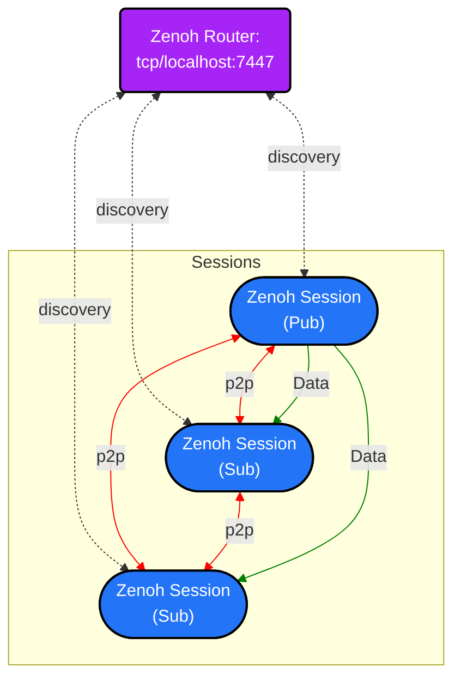

# Design

## Network Topology

The following diagram shows the default network topology of a subsystem composed of 3 nodes:

Default Configuration for Zenoh Sessions:
| Config | Zenoh Session    | Zenoh Router    |
| :---:   | :---: | :---: |
| Mode | Peer   | Router   |
| Connect | tcp/localhost:7447   |  -  |
| UDP Multicast | Disabled | Disabled   |
| Gossip Scouting | Enabled | Enabled   |

### Notes

 - Zenoh routers (a.k.a. `zenohd`) are required mainly to allow the peers to discover each other within the subsystem.
 - Zenoh sessions are configured in `peer` mode and connect directly to the router looking for other peers. As `gossip` scouting is being used, the router is in charge to spread the discovery information across the peers of the subsystem.
 - Each Zenoh sessions discover each other and creates direct `Peer-To-Peer` connection between them and the connection remains without relying on the router.
 - By means of the `Peer-To-Peer` connection, the publisher-subscriber interaction happens: Data flows from the publishers to the subscribers.
